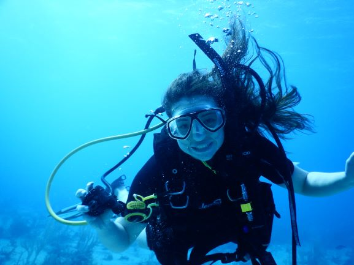
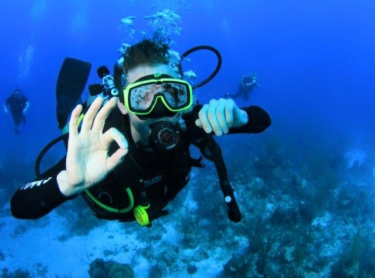
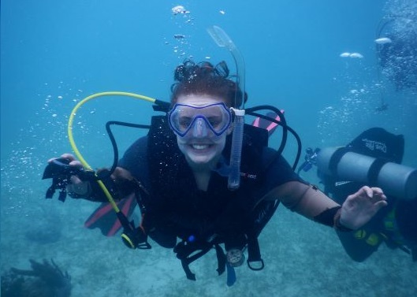
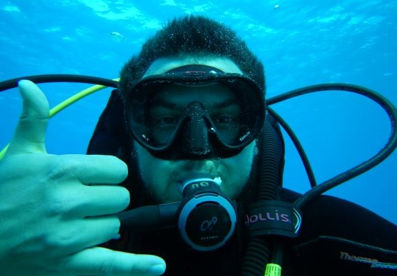
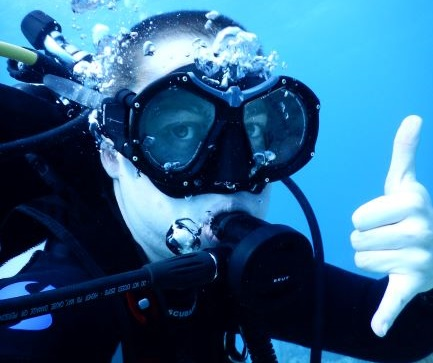
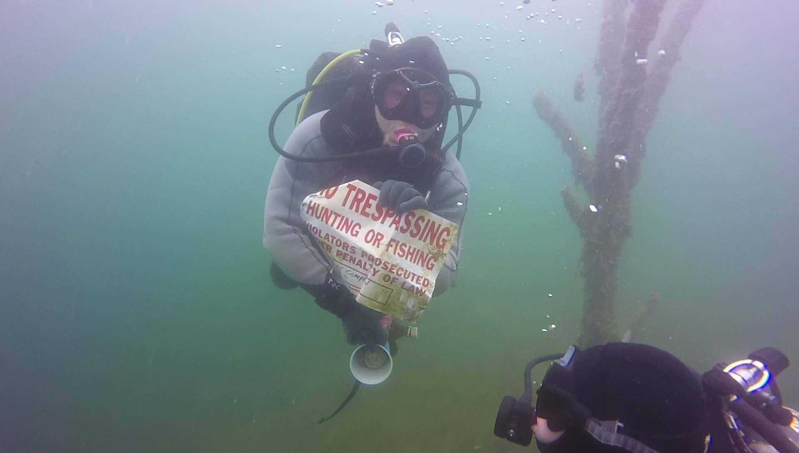
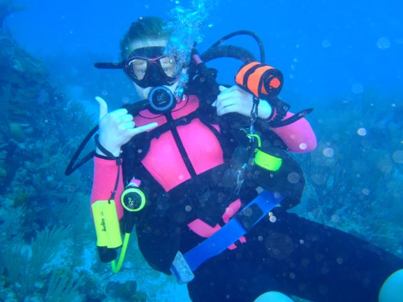
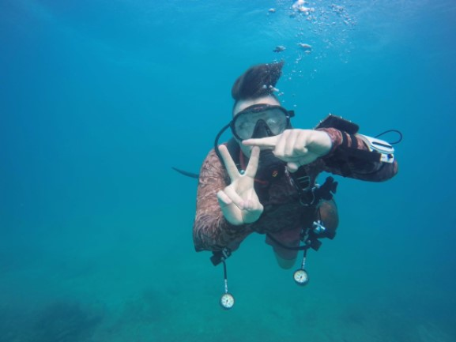

### The ones that keep us afloat:  
   

  

      
      <strong>President:</strong> Ashley Bond IANTD Rescue diver 
      <em>"Yearbook quote"</em>  
  

  

      
      <strong>Vice President:</strong> Clay Cunningham IANTD Rescue diver 
      <em>"Yearbook quote"</em>  
  

  

      
      <strong>Treasurer:</strong> James Fishenden IANTD Open Water diver 
      <em>"Yearbook quote"</em>  
  

  

      
      <strong>Secretary:</strong> Sarah Wilson IANTD Open Water diver 
      <em>"Yearbook quote"</em>  
  

  

      
      <strong>Marketing Director:</strong> Rachel Showers IANTD Open Water diver 
      <em>"Yearbook quote"</em>  
  

  

      
      <strong>Dive Director:</strong> Tyler Ruf IANTD Dive Master 
      <em>"Yearbook quote"</em>  
  

  

      
      <strong>Dive Director:</strong> Joey Griffiths IANTD Dive Master 
      <em>"Yearbook quote"</em>  
  

  

      
      <strong>Webmaster:</strong> Daniel Chen IANTD Dive Master 
      <em>"Yearbook quote"</em>  
  

  

      
      <strong>Webmaster:</strong> Eric Walters IANTD Rescue Diver 
      <em>"Yearbook quote"</em>  
  

  

      
      <strong>Gear Officer:</strong> Nicholas Dyben IANTD Rescue diver 
      <em>"Yearbook quote"</em>  
  

  

      
      <strong>Gear Officer:</strong> Kevin Bryan IANTD Advanced Open Water diver 
      <em>"Yearbook quote"</em>  
  

  

      
      <strong>Gear Officer:</strong> Christine Ellis IANTD Advanced Open Water diver 
      <em>"Yearbook quote"</em>  
  

  

      
      <strong>Gear Officer:</strong> Eli Carwile IANTD Advanced Open Water diver 
      <em>"Yearbook quote"</em>  
  

  

  

  

  

 
 
 
 
**President:** Ashley Bond, Rescue Diver  
**Vice President:** Clay Cunningham, Rescue Diver  
**Treasurer:** Riley Randall, Open Water  
**Secretary:** Sarah Wilson, Open Water  
**Marketing Director:** Rachel Showers, Open Water  
**Dive Director:** Tyler Ruf, Dive Master  
**Dive Director:** Joey Griffiths, Dive Master  
**Webmaster:** Daniel Chen, Dive Master  
**Webmaster:** Eric Walters, Rescue Diver  
**Gear Officer:** Nicholas Dyben, Rescue Diver  
**Gear Officer:** Kevin Bryan, Advanced Open Water  
**Gear Officer:** Christine Ellis, Advanced Open Water  
**Gear Officer:** Eli Carwile, Advanced Open Water  
